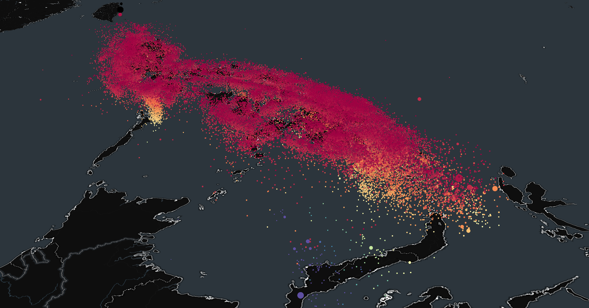

# Philippine Historical Earthquake Locator 3D

An interactive 3D web application for visualizing historical earthquake data within the Philippine region. This tool allows users to explore the location, magnitude, and depth of past seismic events on a dynamic globe.

**Live Demo Link:** [**https://greturn.github.io/philippines-equake-locator-3d/**](https://greturn.github.io/philippines-equake-locator-3d/)



---

## Details

Made with TS, React, Vite.

The historical earthquake data used in this project is sourced from the official public records of the:
* **[Philippine Institute of Volcanology and Seismology (PHIVOLCS)](https://www.phivolcs.dost.gov.ph/)**

**Disclaimer:** This tool is intended for educational and informational purposes only. It is **not** to be used for real-time monitoring or disaster response. Please always refer to official government agencies for alerts.

---

## 🚀 Getting Started (For Developers)

If you wish to run this project locally:

1.  **Clone the repository:**
    ```bash
    git clone https://github.com/GReturn/philippines-equake-locator-3d.git
    ```

2.  **Navigate to the project directory:**
    ```bash
    cd philippines-equake-locator-3d
    ```

3.  **Install dependencies:**
    *(Use the command appropriate for your project)*
    ```bash
    npm install
    ```

4.  **Start:**
    ```bash
    npm run dev
    ```

5.  Open [http://localhost:3000](http://localhost:3000) (or your project's local port) in your browser.

---

## 📄 License

This project is licensed under the MIT License. See the `LICENSE` file for details.
